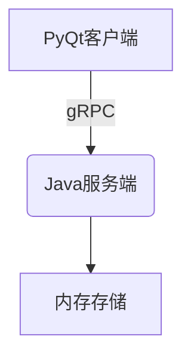

# 医院预约系统 (Hospital Appointment System)

## 项目结构

| 目录           | 说明             |
| -------------- | ---------------- |
| `APPOINT-SYS/` | Java服务端代码   |
| `CLIENT/`      | Python客户端代码 |

## 系统架构



- **服务端**: 使用ConcurrentHashMap实现内存存储，保证线程安全
- **客户端**: 使用PySide6实现图形界面
- **通信**: gRPC协议，端口8189

## 详细功能

### 核心功能
✅ 预约挂号 - 填写患者信息、选择科室和时段
✅ 按ID查询 - 通过预约ID查询详细信息
✅ 按姓名查询 - 查询患者所有预约记录
✅ 取消预约 - 通过ID取消预约

### 技术特点
✅ 线程安全的内存存储
✅ 响应式图形界面
✅ 基于gRPC的高效通信

## API详细说明

完整gRPC服务定义 (`APPOINT-SYS/src/main/proto/hospital.proto`):

```proto
service HospitalService {
  rpc BookAppointment(Appointment) returns (OperationResponse);  // 预约挂号
  rpc QueryByID(AppointmentIDRequest) returns (Appointment);     // ID查询
  rpc QueryByPatient(PatientRequest) returns (AppointmentList);  // 患者查询
  rpc CancelAppointment(AppointmentIDRequest) returns (OperationResponse); // 取消预约
}

// 预约信息
message Appointment {
  int32 id = 1;
  string patient_name = 2;
  string doctor_name = 3;
  string department = 4;
  string date = 5;        // 格式：YYYY-MM-DD
  string time_slot = 6;   // 如 "14:00-15:00"
}

// 请求/响应结构
message AppointmentIDRequest { int32 id = 1; }
message PatientRequest { string patient_name = 1; }
message OperationResponse {
  bool success = 1;
  string message = 2;
}
message AppointmentList {
  repeated Appointment appointments = 1;
}
```
## 贡献

欢迎提交Issue和Pull Request！
