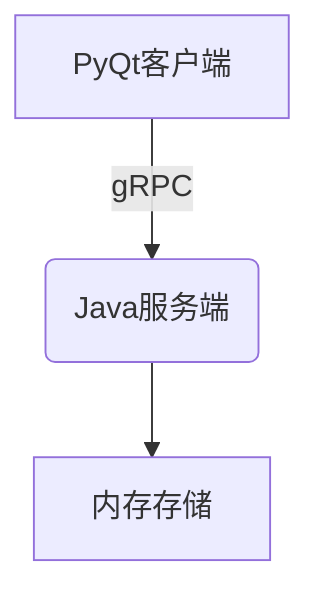

# 医院预约系统 (Hospital Appointment System)


## 项目概述

一个基于gRPC的分布式医院预约管理系统，采用C/S架构设计：

- **服务端**：使用Java实现，提供稳定的预约服务核心逻辑
- **客户端**：使用Python+PyQt实现，提供友好的图形用户界面
- **通信协议**：使用gRPC+Protocol Buffers实现高效的服务调用

系统实现了医院预约全流程管理，包括患者挂号、医生排班、预约查询等功能。

## 项目结构

| 目录           | 说明             |
| -------------- | ---------------- |
| `APPOINT-SYS/` | Java服务端代码   |
| `CLIENT/`      | Python客户端代码 |

## 技术栈

- **服务端**: Java 17, gRPC
- **客户端**: Python 3.10, PyQt6, gRPC
- **通信协议**: Protocol Buffers (proto3)

## 系统架构



- **服务端**: 使用ConcurrentHashMap实现内存存储，保证线程安全
- **客户端**: 使用PySide6实现图形界面
- **通信**: gRPC协议，端口8189

## 详细功能

### 核心功能
✅ 预约挂号 - 填写患者信息、选择科室和时段
✅ 按ID查询 - 通过预约ID查询详细信息
✅ 按姓名查询 - 查询患者所有预约记录
✅ 取消预约 - 通过ID取消预约

### 技术特点
✅ 线程安全的内存存储
✅ 响应式图形界面
✅ 基于gRPC的高效通信

## 完整安装指南

### 服务端要求
- Java 17+
- Maven 3.8+

### 客户端要求
- Python 3.10+
- PySide6
- grpcio-tools

### 服务端安装
1. 构建项目:
```bash
cd APPOINT-SYS
mvn clean package
```

2. 启动服务:
```bash
java -jar target/appointment-system.jar
```

### 客户端安装
1. 安装依赖:
```bash
cd CLIENT
pip install -r requirements.txt
```

2. 生成gRPC代码:
```bash
python -m grpc_tools.protoc -I. --python_out=. --grpc_python_out=. hospital.proto
```

3. 运行客户端:
```bash
python main.py
```

> 注意：服务端默认监听8189端口，客户端连接localhost:8189

## API详细说明

完整gRPC服务定义 (`APPOINT-SYS/src/main/proto/hospital.proto`):

```proto
service HospitalService {
  rpc BookAppointment(Appointment) returns (OperationResponse);  // 预约挂号
  rpc QueryByID(AppointmentIDRequest) returns (Appointment);     // ID查询
  rpc QueryByPatient(PatientRequest) returns (AppointmentList);  // 患者查询
  rpc CancelAppointment(AppointmentIDRequest) returns (OperationResponse); // 取消预约
}

// 预约信息
message Appointment {
  int32 id = 1;
  string patient_name = 2;
  string doctor_name = 3;
  string department = 4;
  string date = 5;        // 格式：YYYY-MM-DD
  string time_slot = 6;   // 如 "14:00-15:00"
}

// 请求/响应结构
message AppointmentIDRequest { int32 id = 1; }
message PatientRequest { string patient_name = 1; }
message OperationResponse {
  bool success = 1;
  string message = 2;
}
message AppointmentList {
  repeated Appointment appointments = 1;
}
```

## 开发环境配置

1. 导入项目到IDE:
   - 服务端: 使用IntelliJ IDEA导入Maven项目
   - 客户端: 使用PyCharm打开Python项目

2. 代码风格:
   - Java: Google Java Style
   - Python: PEP 8

3. 调试:
   - 服务端: 使用Maven Debug模式
   - 客户端: 使用Python Debugger

## 客户端界面

 *(截图待添加)*

## 贡献

欢迎提交Issue和Pull Request！
